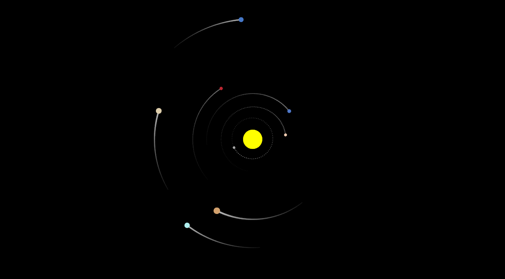
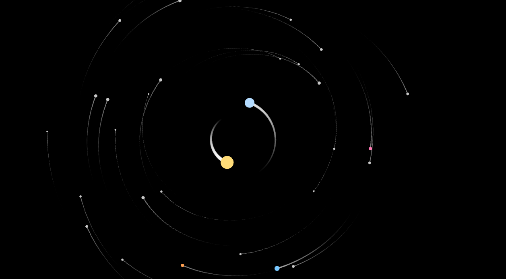

# Gravisim
Gravisim is a 2D gravity sandbox written in C++ using SFML. It simulates Newtonian attraction between multiple bodies and lets you fly a camera around to watch systems evolve in real time.

  
  

## Highlights
- Deterministic fixed-timestep physics (120 Hz by default) for stable orbits.
- Simple n-body gravity with softening to avoid singularities.
- Per-body velocity control and orbit trails to visualize motion.
- Multiple built-in scenarios (solar system, three-body, circumbinary, many-body stress test).
- Toggleable simulation speed and pause; enable/disable trails on the fly.
- Camera based on `sf::View` for smooth pan/zoom without touching physics state.

## Controls (default)
- Arrow keys: pan camera.
- U / D / R: speed up, slow down, reset simulation speed.
- Space: pause/resume (timescale 0/1).
- P: toggle trails (clears existing trails when toggled).
- Close window: exit.

## Simulation Scenarios
- **Solar System**: Sun + 8 planets with roughly proportional masses and orbital radii.
- **Three-Body Problem**: Chaotic motion of three massive bodies.
- **Circumbinary Trojans**: Planet orbiting a binary system plus trojan asteroids.
- **Many-Body System**: Randomized positions/velocities for emergent patterns and stress testing.

## Dependencies
- C++20
- SFML 2.6+

## File Structure
- `src/` - Source code
  - `main.cpp` - Entry point, scenario selection
  - `sim_solarsystem.hpp`, `sim_threebody.hpp`, `sim_circumbinarytrojans.hpp`, `sim_lotofbody.hpp` - Scenario definitions
  - `core/` - Simulation engine and settings (`Simulation`, `core_settings`)
  - `bodies/` - Body and manager classes, trails
